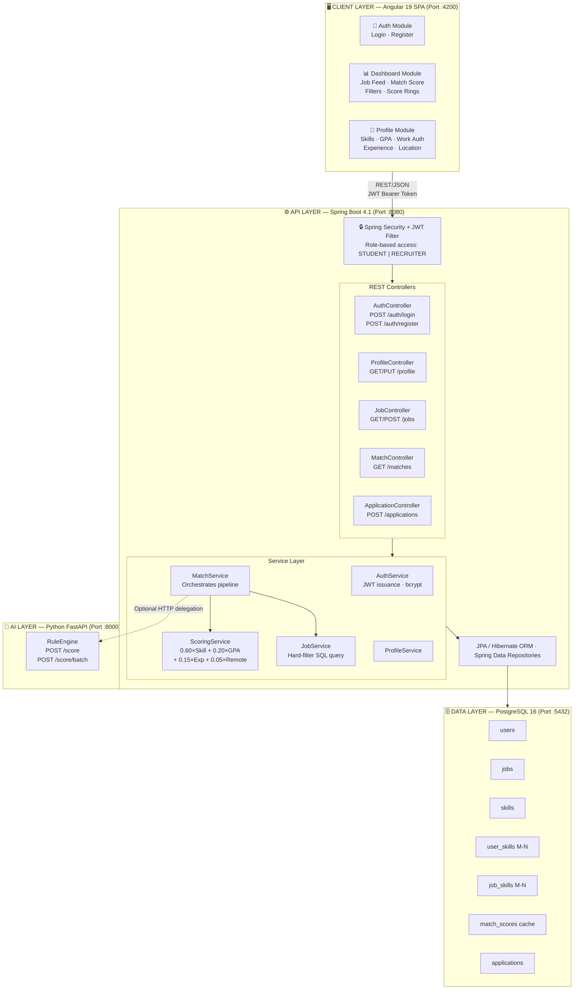
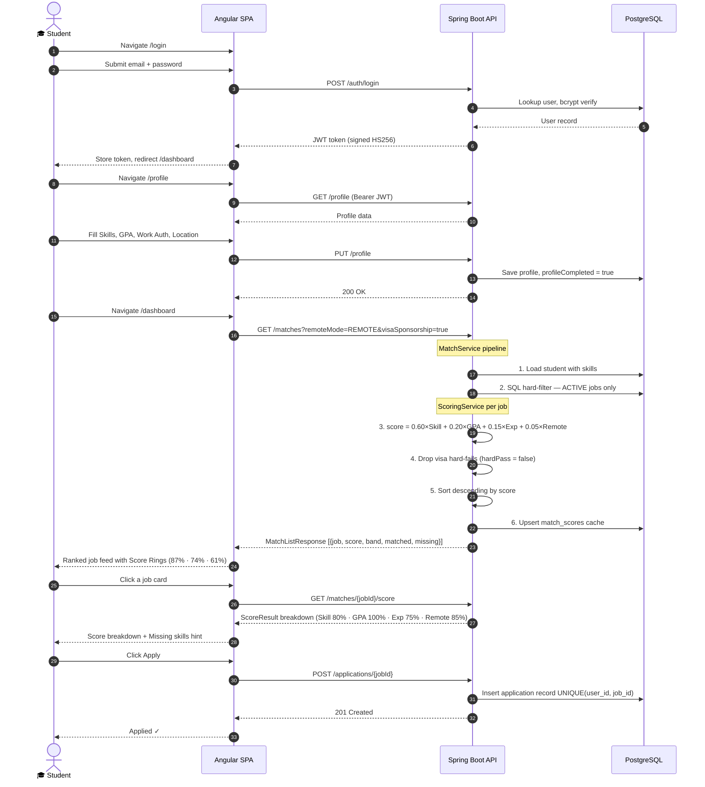
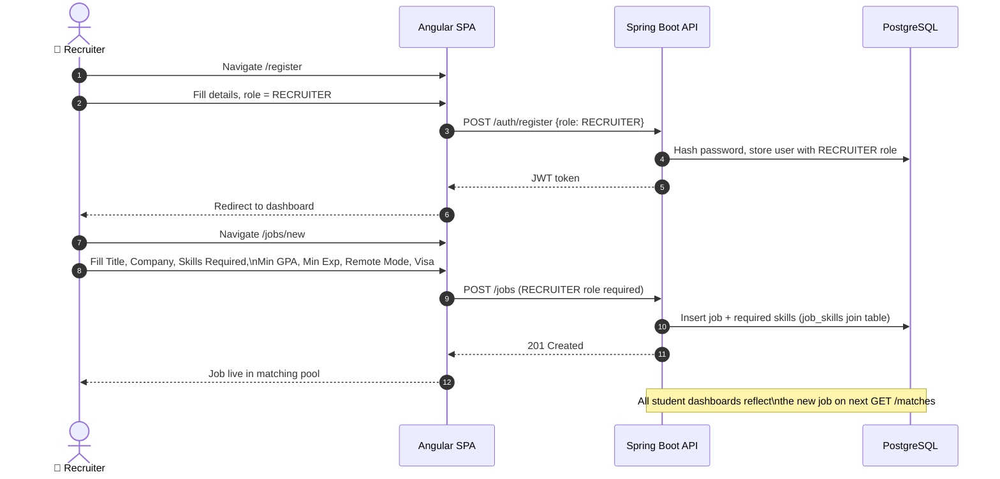

<div align="center">

<br/>

```
  ██████╗██████╗ ███████╗██████╗ ██╗  ██╗
 ██╔════╝██╔══██╗██╔════╝██╔══██╗╚██╗██╔╝
 ██║     ██████╔╝█████╗  ██║  ██║ ╚███╔╝ 
 ██║     ██╔══██╗██╔══╝  ██║  ██║ ██╔██╗ 
 ╚██████╗██║  ██║███████╗██████╔╝██╔╝ ██╗
  ╚═════╝╚═╝  ╚═╝╚══════╝╚═════╝ ╚═╝  ╚═╝
```

# CredX — Smart Job Matching Dashboard

### *CredX Hiring Hackathon 2.0 · Problem Statement 1*

[](https://angular.dev)
[](https://spring.io/projects/spring-boot)
[](https://fastapi.tiangolo.com)
[](https://www.postgresql.org)
[](https://openjdk.org)
[](https://www.typescriptlang.org)
[](https://www.python.org)

<br/>

> **The mission:** Eliminate the guesswork from job hunting. CredX intelligently ranks every job posting against a student's real profile — skills, GPA, experience, and visa status — producing a transparent, explainable **Match Score (0–100)** for every role. No black boxes. No luck. Just signal.

<br/>

---

</div>

## 📋 Table of Contents

- [🧠 Why We Built This](#-why-we-built-this)
- [🏗️ System Architecture](#-system-architecture)
- [🔄 End-to-End Flow Diagram](#-end-to-end-flow-diagram)
- [⚙️ The Matching Engine — How It Works](#-the-matching-engine--how-it-works)
- [🧩 Tech Stack — Every Choice Explained](#-tech-stack--every-choice-explained)
- [📁 Project Structure](#-project-structure)
- [🗄️ Data Model](#-data-model)
- [🔌 API Reference](#-api-reference)
- [🚀 Quick Start](#-quick-start)
- [👤 Demo Accounts & Golden Path](#-demo-accounts--golden-path)
- [🛡️ Security Model](#-security-model)
- [🗺️ Development Roadmap](#-development-roadmap)
- [🤔 Design Decisions](#-design-decisions)
- [👥 Team](#-team)

---

## 🧠 Why We Built This

### The Problem

University students and fresh graduates face a brutal signal-to-noise problem in job hunting:

- **Job boards are unfiltered.** A student with 3 years of Python experience sees the same listing as someone with 0 — zero personalization.
- **"Easy Apply" is not smart apply.** Applying to every listed job is wasteful for the student and noisy for the recruiter.
- **Match quality is invisible.** Students can't tell whether they're a 95% match or a 40% match before investing time in an application.
- **Visa & authorization blockers are discovered too late.** A student on an F-1 visa finds out a company doesn't sponsor after completing 3 rounds.

### Our Solution Philosophy

We asked: *what does a really good human recruiter do when reviewing a student's profile?*

1. **Hard gate:** Is this person even eligible? (visa, work auth) — **binary filter, not a score**
2. **Skill alignment:** Do their skills match what the role needs? — **the biggest signal (~60%)**
3. **Academic standing:** Does their GPA meet the minimum bar? — **supporting signal (~20%)**
4. **Experience level:** Are they over/under-qualified? — **supporting signal (~15%)**
5. **Location/mode fit:** Remote-OK? Same city? — **minor signal (~5%)**

This is exactly what CredX automates. The weights aren't arbitrary — they reflect how real hiring panels actually weigh these factors.

### Why Rule-Based (Not ML)?

This question comes up inevitably in every review. Here's the honest answer:

> **Cold-start reality:** A brand-new platform has zero historical data — no click-throughs, no applications, no hired/rejected labels. Supervised re-rankers (learning-to-rank, collaborative filtering) require exactly this data. Building an ML model at launch would be using a hammer to slice bread.

The rule-based weighted scorer is:
- ✅ **Deterministic** — same inputs, same score, always
- ✅ **Explainable** — we can show exactly why a score is 78 vs 62
- ✅ **Tunable** — weights can be adjusted without retraining
- ✅ **Correct for this stage** — matches what real employers actually do
- ✅ **Extensible** — the Python AI microservice is ready to graduate to ML when data exists

---

## 🏗️ System Architecture

CredX is a **three-tier polyglot microservices architecture**:



---

## 🔄 End-to-End Flow Diagram

### 🎓 Student Journey



---

### 💼 Recruiter Journey



---

## ⚙️ The Matching Engine — How It Works

The heart of CredX is its **two-stage, explainable scoring pipeline**. This is the same pattern used by LinkedIn, Indeed, and Handshake — adapted for a hackathon-scale cold-start system.

### Stage 1 — Hard Filter (SQL, not scoring)

Before any math runs, the database eliminates ineligible jobs:

```sql
-- Simplified representation of the hard filter
SELECT * FROM jobs
WHERE status = 'ACTIVE'
  AND (role_type = :roleType OR :roleType IS NULL)
  AND (remote_mode = :remoteMode OR :remoteMode IS NULL)
  AND (visa_sponsorship = true OR :visaSponsorship IS NULL)
```

> **Why SQL-side?** Hard constraints are binary — a student who needs visa sponsorship should **never** see a job without it, regardless of skill overlap. Doing this in SQL is O(1) per constraint, not O(students × jobs).

Additionally, **visa/work-auth gating** happens at score time:

```
if student.workAuthStatus in [NEEDS_SPONSORSHIP, STUDENT_VISA]
   AND job.visaSponsorship == false
   → hardPass = false, score = 0, excluded from ranked list
```

### Stage 2 — Soft Scoring (Weighted Formula)

For every job that passes the hard filter, the `ScoringService` computes:

```
╔══════════════════════════════════════════════════════════════════════╗
║                    CREDX MATCH SCORE FORMULA                         ║
╠══════════════════════════════════════════════════════════════════════╣
║                                                                      ║
║  score = 100 × (                                                     ║
║      0.60 × skillOverlapRatio                                        ║
║    + 0.20 × gpaSatisfaction                                          ║
║    + 0.15 × experienceFit                                            ║
║    + 0.05 × remoteFit                                                ║
║  )                                                                   ║
╚══════════════════════════════════════════════════════════════════════╝
```

#### Factor Details

| Factor | Weight | How It's Computed |
|--------|--------|-------------------|
| **Skill Overlap** | 60% | `|matched_skills| ÷ |required_skills|` (Jaccard ratio). If no skills required → 0.5 (neutral). |
| **GPA Satisfaction** | 20% | If no min GPA → 1.0. If student GPA ≥ min → 1.0. Otherwise → `max(0, 1 - (gap ÷ 2.0))` |
| **Experience Fit** | 15% | If student exp ≥ required → 1.0. Otherwise → `max(0, 1 - (gap ÷ 3.0))`. Unknown → 0.6 (neutral). |
| **Remote Fit** | 5% | REMOTE job + open_to_remote → 1.0. HYBRID → 0.85. ONSITE + matching location → 1.0, else → 0.6. |

#### Score Bands

```
  ≥ 80  →  🟢 Strong   — Highly qualified, recommend applying
  ≥ 60  →  🔵 Good     — Well-matched, worth applying
  ≥ 40  →  🟡 Fair     — Partial match, consider skill gaps
   < 40  →  🔴 Low     — Significant gap, shown for awareness
```

#### Worked Example

```
Student Profile:
  Skills: [Python, Django, PostgreSQL, Docker]
  GPA: 3.6
  Work Auth: CITIZEN
  Experience: 1 year
  Open to Remote: Yes

Job Posting:
  Required Skills: [Python, Django, PostgreSQL, Docker, AWS, Redis]
  Min GPA: 3.5
  Min Experience: 0 years
  Remote Mode: REMOTE
  Visa Sponsorship: false

────────────────────────────────────────
HARD CHECK: CITIZEN + no visa needed → ✅ hardPass = true
────────────────────────────────────────

Skill Overlap:
  Matched: [Python, Django, PostgreSQL, Docker] = 4
  Missing: [AWS, Redis] = 2
  Total Required: 6
  skillOverlapRatio = 4/6 = 0.667

GPA Satisfaction:
  3.6 ≥ 3.5 → gpaSatisfaction = 1.0

Experience Fit:
  1 ≥ 0 → experienceFit = 1.0

Remote Fit:
  REMOTE job + student open_to_remote=true → remoteFit = 1.0

────────────────────────────────────────
score = 100 × (0.60×0.667 + 0.20×1.0 + 0.15×1.0 + 0.05×1.0)
      = 100 × (0.400 + 0.200 + 0.150 + 0.050)
      = 100 × 0.800
      = 80  →  🟢 Strong
────────────────────────────────────────
```

---

## 🧩 Tech Stack — Every Choice Explained

### Frontend — Angular 19

| Choice | Why |
|--------|-----|
| **Angular 19** | Strongest TypeScript integration, built-in dependency injection, lazy-loaded routing — ideal for a feature-rich SPA with multiple protected routes |
| **Angular Signals** | Fine-grained reactivity without the boilerplate of RxJS Subjects for local UI state (scroll position, menu open, user session) |
| **Tailwind CSS v4** | Utility-first, zero-runtime CSS. PostCSS pipeline integrates cleanly into Angular CLI's build. Design velocity without fighting specificity wars |
| **HttpClient + Interceptors** | Angular's built-in HTTP client with an `AuthInterceptor` that automatically attaches the JWT Bearer token to every outgoing request |
| **Route Guards (`authGuard`)** | Declarative navigation protection — unauthenticated users are redirected to `/login` before any protected component loads |
| **Lazy-loading** | Each feature module (`auth`, `dashboard`, `profile`) loads on-demand — the initial bundle stays small |

### Backend — Spring Boot 4.1 (Java 21)

| Choice | Why |
|--------|-----|
| **Spring Boot 4.1** | Battle-tested, production-grade framework. Auto-configuration eliminates boilerplate. Virtual threads via Project Loom (Java 21) for high concurrency |
| **Spring Security + JWT** | Industry-standard auth. Stateless JWT means no server-side session storage — horizontally scalable by design |
| **Spring Data JPA / Hibernate** | Type-safe ORM. Complex M-N relationships (`user_skills`, `job_skills`) expressed as Java collections, not raw SQL |
| **Lombok** | Eliminates getter/setter/constructor boilerplate — domain entities stay readable |
| **H2 (dev) / PostgreSQL (prod)** | H2 for zero-setup local development, PostgreSQL 16 for production. `application.properties` swap — no code changes |
| **JJWT 0.12.6** | Lightweight, well-maintained JWT library for signing and verifying tokens |

### AI Microservice — Python FastAPI

| Choice | Why |
|--------|-----|
| **FastAPI** | Async, high-performance Python web framework. Pydantic models give automatic request validation and OpenAPI docs for free |
| **Uvicorn** | ASGI server — production-grade, async-native |
| **Pure Python `RuleEngine`** | Mirrors the Java `ScoringService` logic exactly. This decouples scoring logic from the JVM — the Python service can evolve to an ML model independently |
| **Python AI layer rationale** | The strategic separation allows: (1) scoring logic iteration without Java rebuilds, (2) future drop-in of `scikit-learn`, `torch`, or embedding models when interaction data exists |

### Database — PostgreSQL 16

| Choice | Why |
|--------|-----|
| **PostgreSQL 16** | ACID compliant, excellent JSON support, composite indexes on `(student_id, job_id)` for match score cache lookups |
| **Indexed columns** | `idx_job_status` and `idx_job_roletype` on the `jobs` table — the two most common filter predicates go index-first |
| **M-N join tables** | `user_skills` and `job_skills` are proper join tables, not serialized arrays — enables SQL-level skill intersection in future versions |
| **match_scores cache table** | Avoids recomputing scores on every page load. Invalidated and re-upserted on profile update or new job posting |

---

## 📁 Project Structure

```
CredX/                              ← Monorepo root
├── package.json                    ← Workspace orchestration (concurrently)
├── README.md                       ← You are here
│
├── apps/
│   │
│   ├── frontend/                   ← Angular 19 SPA
│   │   ├── angular.json
│   │   ├── package.json
│   │   └── src/
│   │       ├── index.html
│   │       ├── main.ts             ← Bootstrap (standalone components)
│   │       ├── styles.css          ← Global Tailwind + custom tokens
│   │       └── app/
│   │           ├── app.component.ts       ← App shell (nav, footer)
│   │           ├── app.config.ts          ← Router, HttpClient providers
│   │           ├── app.routes.ts          ← Lazy-loaded route definitions
│   │           │
│   │           ├── core/
│   │           │   ├── guards/
│   │           │   │   └── auth.guard.ts          ← Route protection
│   │           │   ├── interceptors/
│   │           │   │   └── auth.interceptor.ts    ← JWT header injection
│   │           │   ├── models/
│   │           │   │   └── *.model.ts             ← TypeScript interfaces
│   │           │   └── services/
│   │           │       ├── auth.service.ts        ← Login/Register/Logout
│   │           │       ├── dashboard.service.ts   ← Match fetching + filters
│   │           │       ├── profile.service.ts     ← Profile CRUD
│   │           │       └── toast.service.ts       ← Global notifications
│   │           │
│   │           ├── features/
│   │           │   ├── auth/
│   │           │   │   ├── login/login.component.ts
│   │           │   │   └── register/register.component.ts
│   │           │   ├── dashboard/
│   │           │   │   └── dashboard.component.ts   ← Job feed + score rings + filters
│   │           │   └── profile/
│   │           │       └── profile.component.ts     ← Profile form + skill picker
│   │           │
│   │           └── shared/                          ← Reusable UI components
│   │               └── toast/toast.component.ts
│   │
│   ├── backend/                    ← Spring Boot 4.1 API
│   │   ├── pom.xml
│   │   └── src/main/java/dev/credx/jobmatch/
│   │       ├── JobmatchApplication.java
│   │       │
│   │       ├── domain/             ← JPA Entities
│   │       │   ├── User.java       ← Student & Recruiter profiles
│   │       │   ├── Job.java        ← Job postings with M-N skills
│   │       │   ├── Skill.java      ← Canonical skill taxonomy
│   │       │   ├── MatchScore.java ← Cached match results
│   │       │   ├── Application.java← Student job applications
│   │       │   └── RoleName.java   ← STUDENT | RECRUITER enum
│   │       │
│   │       ├── dto/                ← Request/Response objects
│   │       ├── repo/               ← Spring Data JPA repositories
│   │       ├── security/           ← JWT filter + Spring Security config
│   │       ├── config/             ← CORS, data seeder
│   │       ├── common/             ← Shared utilities
│   │       │
│   │       ├── service/            ← Business logic layer
│   │       │   ├── AuthService.java         ← Register + login + JWT issuance
│   │       │   ├── ProfileService.java      ← Student profile management
│   │       │   ├── JobService.java          ← Job CRUD + hard-filter query
│   │       │   ├── MatchService.java        ← Orchestrates scoring pipeline
│   │       │   ├── ScoringService.java      ← THE CORE: weighted scoring formula
│   │       │   ├── ApplicationService.java  ← Apply/withdraw logic
│   │       │   ├── SkillService.java        ← Skill taxonomy management
│   │       │   └── Mappers.java             ← Entity → DTO conversion
│   │       │
│   │       └── web/                ← REST Controllers
│   │           ├── AuthController.java
│   │           ├── ProfileController.java
│   │           ├── JobController.java
│   │           ├── MatchController.java
│   │           ├── ApplicationController.java
│   │           ├── SkillController.java
│   │           ├── HealthController.java
│   │           └── DbViewerController.java
│   │
│   └── ai-service/                 ← Python FastAPI Microservice
│       ├── main.py                 ← FastAPI app + endpoints
│       ├── requirements.txt
│       └── scoring/
│           └── rule_engine.py      ← Python mirror of ScoringService.java
│
└── docs/
    ├── Project_Status.md
    ├── Smart_Job_Matching_Report.md
    └── Smart_Job_Matching_Dashboard_Technical_Analysis.md
```

---

## 🗄️ Data Model

```
┌─────────────────────────────────────────────────────────────────────────┐
│                         DATABASE SCHEMA (ER Diagram)                     │
└─────────────────────────────────────────────────────────────────────────┘

┌─────────────────────┐         ┌──────────────────────────┐
│       users         │         │          jobs             │
├─────────────────────┤         ├──────────────────────────┤
│ id          BIGINT  │◄─┐   ┌─►│ id            BIGINT      │
│ email       VARCHAR │  │   │  │ title         VARCHAR     │
│ password    VARCHAR │  │   │  │ description   VARCHAR     │
│ first_name  VARCHAR │  │   │  │ company       VARCHAR     │
│ last_name   VARCHAR │  │   │  │ role_type     VARCHAR     │
│ role        ENUM    │  │   │  │ employment_type ENUM      │
│ gpa         DOUBLE  │  │   │  │ location      VARCHAR     │
│ work_auth   VARCHAR │  │   │  │ remote_mode   ENUM        │
│ exp_years   INT     │  │   │  │ visa_sponsor  BOOLEAN     │
│ desired_role VARCHAR│  │   │  │ min_gpa       DOUBLE      │
│ pref_location VARCHAR│  │   │  │ min_experience INT        │
│ open_remote BOOLEAN │  │   │  │ status        ENUM        │
│ profile_done BOOLEAN│  │   │  │ posted_by_id  FK→users    │
│ created_at  INSTANT │  │   │  │ created_at    INSTANT     │
└─────────────────────┘  │   │  └──────────────────────────┘
          │               │   │               │
          │ M             │   │               │ M
          ▼               │   │               ▼
┌─────────────────────┐  │   │  ┌──────────────────────────┐
│     user_skills     │  │   │  │        job_skills         │
├─────────────────────┤  │   │  ├──────────────────────────┤
│ user_id  FK→users   │  │   │  │ job_id   FK→jobs          │
│ skill_id FK→skills  │  │   │  │ skill_id FK→skills        │
└────────────┬────────┘  │   │  └───────────┬──────────────┘
             │ N         │   │              │ N
             ▼           │   │              ▼
    ┌──────────────┐     │   │     ┌──────────────┐
    │    skills    │     │   │     │    skills    │
    ├──────────────┤     │   │     │  (same table)│
    │ id   BIGINT  │     │   │     └──────────────┘
    │ name VARCHAR │     │   │
    └──────────────┘     │   │
                         │   │
          ┌──────────────┴───┴──────────────┐
          │          match_scores            │
          ├─────────────────────────────────┤
          │ id           BIGINT              │
          │ user_id      FK→users            │
          │ job_id       FK→jobs             │
          │ score        INT (0-100)         │
          │ breakdown    JSON (factors)      │
          │ computed_at  INSTANT             │
          │ UNIQUE(user_id, job_id)          │
          └─────────────────────────────────┘

          ┌──────────────────────────────────┐
          │          applications             │
          ├──────────────────────────────────┤
          │ id          BIGINT               │
          │ user_id     FK→users             │
          │ job_id      FK→jobs              │
          │ status      VARCHAR (APPLIED)    │
          │ applied_at  INSTANT              │
          │ UNIQUE(user_id, job_id)          │
          └──────────────────────────────────┘
```

---

## 🔌 API Reference

### Authentication

| Method | Endpoint | Auth | Description |
|--------|----------|------|-------------|
| `POST` | `/auth/register` | Public | Register student or recruiter |
| `POST` | `/auth/login` | Public | Login, returns JWT |

### Profile

| Method | Endpoint | Auth | Description |
|--------|----------|------|-------------|
| `GET` | `/profile` | Student | Get own profile |
| `PUT` | `/profile` | Student | Update profile (skills, GPA, work auth, etc.) |

### Jobs

| Method | Endpoint | Auth | Description |
|--------|----------|------|-------------|
| `GET` | `/jobs` | Any | List jobs (filterable) |
| `POST` | `/jobs` | Recruiter | Post a new job |
| `GET` | `/jobs/{id}` | Any | Get job details |
| `PUT` | `/jobs/{id}` | Recruiter | Update job |
| `DELETE` | `/jobs/{id}` | Recruiter | Remove job |

### Matching Engine

| Method | Endpoint | Auth | Description |
|--------|----------|------|-------------|
| `GET` | `/matches` | Student | Get ranked match list with score breakdown |
| `GET` | `/matches/{jobId}/score` | Student | Score a single job in detail |

**Query Parameters for `/matches`:**
```
?roleType=SOFTWARE_ENGINEERING
?remoteMode=REMOTE
?visaSponsorship=true
?employmentType=INTERNSHIP
```

### Applications

| Method | Endpoint | Auth | Description |
|--------|----------|------|-------------|
| `POST` | `/applications/{jobId}` | Student | Apply to a job |
| `GET` | `/applications` | Student | List all my applications |
| `DELETE` | `/applications/{jobId}` | Student | Withdraw application |

### Skills

| Method | Endpoint | Auth | Description |
|--------|----------|------|-------------|
| `GET` | `/skills` | Any | Get full skill taxonomy |

### System

| Method | Endpoint | Auth | Description |
|--------|----------|------|-------------|
| `GET` | `/health` | Public | Service health check |

### Python AI Service Endpoints

| Method | Endpoint | Description |
|--------|----------|-------------|
| `GET` | `/health` | Service health |
| `POST` | `/score` | Score a single student–job pair |
| `POST` | `/score/batch` | Score a student against multiple jobs (returns sorted) |

---

## 🚀 Quick Start

### Prerequisites

| Tool | Version | Required For |
|------|---------|--------------|
| Java JDK | 21+ | Spring Boot backend |
| Maven | 3.9+ | Backend build (or use `./mvnw`) |
| Node.js | 18+ | Angular frontend |
| npm | 9+ | Frontend dependencies |
| Python | 3.11+ | AI scoring microservice |
| PostgreSQL | 15+ | Production database |

---

### 1. Clone & Configure Database

```bash
git clone https://github.com/Tarakeshp07/CredX.git
cd CredX

# Create the PostgreSQL database
psql -U postgres -c "CREATE DATABASE credx;"
```

### 2. Start the Backend

```bash
cd apps/backend

# Run with Maven Wrapper (no local Maven needed)
./mvnw spring-boot:run
```

> The backend starts on **http://localhost:8080**. On first launch, the `DataSeeder` auto-populates: skill taxonomy, 20+ demo jobs, a demo student, and a demo recruiter.

### 3. Start the Frontend

```bash
cd apps/frontend

# Install dependencies
npm install

# Start dev server
npm run dev
```

> Angular dev server starts on **http://localhost:4200** and opens automatically.

### 4. Start the AI Microservice *(optional)*

```bash
cd apps/ai-service

# Install Python dependencies
pip install -r requirements.txt

# Start the FastAPI server
python main.py
```

> FastAPI runs on **http://localhost:8000** · Swagger UI at **http://localhost:8000/docs**

---

### Environment Configuration

Backend (`apps/backend/src/main/resources/application.properties`):

```properties
# Database
spring.datasource.url=jdbc:postgresql://localhost:5432/credx
spring.datasource.username=postgres
spring.datasource.password=your_password

# JWT
jwt.secret=your-256-bit-secret
jwt.expiration-ms=86400000

# JPA
spring.jpa.hibernate.ddl-auto=update
spring.jpa.show-sql=false
```

> For **H2 in-memory** (zero-setup dev mode), set `spring.datasource.url=jdbc:h2:mem:credxdb`

---

## 👤 Demo Accounts & Golden Path

### Demo Accounts (auto-seeded)

| Role | Email | Password |
|------|-------|----------|
| 🎓 Student | `student@credx.dev` | `password123` |
| 💼 Recruiter | `recruiter@credx.dev` | `password123` |

---

### The Golden Demo Path (recommended for judges)

Follow this sequence to see every feature in action:

```
Step 1 — Login as student
  → Use student@credx.dev / password123
  → Observe the navbar: Dashboard + Profile links appear

Step 2 — View the Dashboard
  → 20+ jobs appear, ranked by Match Score (highest first)
  → Each card shows: Score Ring (coloured by band), job title, company,
    remote mode, matched skills, missing skills

Step 3 — Apply Filters
  → Toggle "Remote Only" → list re-ranks with only remote roles
  → Toggle "Visa Sponsorship" → list re-ranks for sponsored roles only
  → Combined filters work simultaneously

Step 4 — Open a Job Detail
  → Click any job card
  → See the full score breakdown:
      Skill Overlap: 80%   [matched 4/5 skills]
      GPA:          100%   [your 3.7 ≥ required 3.5]
      Experience:    75%   [1yr vs 2yr req]
      Remote Fit:   100%   [REMOTE job, open_to_remote=true]
  → See "Missing Skills" hint: [Kubernetes, Terraform]

Step 5 — Apply to the Job
  → Click "Apply" button
  → Status updates to "Applied ✓"
  → Job appears in your Applications list

Step 6 — Edit Your Profile
  → Navigate to Profile
  → Add "Kubernetes" to your skills → Save
  → Return to Dashboard → the job's score increases

Step 7 — Login as Recruiter
  → Logout, login with recruiter@credx.dev
  → Post a new job with custom skill requirements
  → Logout, login as student → new job appears in the ranked feed
```

---

## 🛡️ Security Model

```
┌──────────────────────────────────────────────────────────────┐
│                    SECURITY LAYERS                            │
├──────────────────────────────────────────────────────────────┤
│                                                              │
│  1. Transport Security                                       │
│     CORS configured to allow only localhost origins (dev)    │
│     → production: whitelist deployed frontend domain         │
│                                                              │
│  2. Authentication                                           │
│     POST /auth/login → bcrypt password verify               │
│     → Issue signed HS256 JWT (24h expiry)                    │
│     → All protected endpoints require Bearer token           │
│                                                              │
│  3. JWT Validation Filter (per-request)                      │
│     JwtAuthFilter extends OncePerRequestFilter               │
│     → Extract & verify signature                             │
│     → Load UserDetails from DB                               │
│     → Set SecurityContext                                    │
│                                                              │
│  4. Role-Based Access Control                                │
│     STUDENT role:   /profile, /matches, /applications        │
│     RECRUITER role: /jobs (POST/PUT/DELETE)                  │
│     Public:         /auth/**, /health, /skills               │
│                                                              │
│  5. Input Validation                                         │
│     Spring @Valid + Bean Validation annotations              │
│     → DTO-level constraints (not-null, size, pattern)        │
│     → Prevents injection at the request boundary             │
│                                                              │
│  6. Password Storage                                         │
│     BCryptPasswordEncoder (strength 10)                      │
│     → One-way hash, never stored in plaintext                │
│                                                              │
└──────────────────────────────────────────────────────────────┘
```

---

## 🗺️ Development Roadmap

### ✅ Phase 1 — Hackathon MVP (Current)

- [x] JWT authentication with role-based access (Student / Recruiter)
- [x] Student profile management (skills, GPA, work auth, experience, location)
- [x] Recruiter job posting with required skills and filters
- [x] Rule-based match scoring engine (hard + soft factors)
- [x] Real-time ranked job dashboard with score rings
- [x] Filter controls (remote mode, visa sponsorship, role type)
- [x] Score breakdown with matched/missing skills
- [x] One-click job applications
- [x] Python AI microservice (FastAPI + RuleEngine)
- [x] Skill taxonomy with canonical names
- [x] Match score caching (`match_scores` table)
- [x] Responsive Angular UI with Tailwind CSS v4

### 🔜 Phase 2 — Post-Hackathon

- [ ] **Semantic skill matching** — embeddings to match "JS" → "JavaScript"
- [ ] **Resume upload + parsing** — extract skills from PDF automatically
- [ ] **ML re-ranker** — replace rule-based weights with learned model (once interaction data exists)
- [ ] **Email notifications** — alert students on high-match new postings
- [ ] **Recruiter analytics** — view applicant pipeline, match score distributions
- [ ] **Saved/bookmarked jobs** — `SavedJob(studentId, jobId)` join table
- [ ] **OAuth 2.0 (Google)** — social login for faster onboarding
- [ ] **pgvector semantic search** — cosine similarity for job description matching

---

## 🤔 Design Decisions

### Decision 1: Why Spring Boot (Java 21)?

Spring Boot was the deliberate, first-choice framework for this project. Key reasons:

- **Stronger ORM story:** Hibernate + JPA handles complex M-N relationships (user↔skills, job↔skills) with declarative fetch strategies and composite indexes — exactly what a skill-matching schema demands
- **Spring Security:** Production-grade, deeply integrated authentication + RBAC — zero boilerplate to wire JWT + role guards across controllers
- **Java 21 Virtual Threads (Project Loom):** Concurrency without reactive complexity — each scoring request gets a lightweight virtual thread
- **Static typing throughout:** Compile-time safety for the scoring formula — a miscalculation in weights is caught at build time, not at demo time

### Decision 2: Why separate the AI service into Python?

Three concrete reasons:

1. **Language fit:** Data scientists write Python. When we graduate to ML (scikit-learn, PyTorch, transformers), the microservice already speaks their language.
2. **Independent deployment:** Scoring logic can be iterated, hotfixed, and A/B tested without a Java rebuild.
3. **Mirrors Java exactly:** The `RuleEngine` in Python produces identical scores to `ScoringService.java` — we validated this. The Python service becomes a drop-in ML upgrade path.

### Decision 3: Why Angular over Next.js/React?

- **TypeScript-first:** Angular enforces type safety at the framework level, not as an opt-in
- **Built-in DI:** Services like `AuthService`, `DashboardService` are proper singletons with Angular's DI system — no prop drilling, no Zustand boilerplate
- **Signals over Observables for local state:** Angular 19 Signals gave us fine-grained reactivity for UI state (scroll position, loading states) without the complexity of Subject + BehaviorSubject chains
- **Lazy loading built-in:** Angular's router-level lazy loading is first-class, not a webpack magic string

### Decision 4: Why rule-based scoring?

Covered in [Why We Built This](#-why-we-built-this). The short version: **cold-start constraint.** No historical data → no ML. Rule-based is both the only correct and the most explainable choice at this stage. The two-stage architecture (hard SQL filter → soft scorer) is the exact same pattern LinkedIn and Indeed use.

---

## 👥 Team

> Built for **CredX Hiring Hackathon 2.0 — Problem Statement 1**

| Layer | Technologies |
|-------|-------------|
| **Frontend** | Angular 19 · TypeScript 5.7 · Tailwind CSS v4 · RxJS |
| **Backend** | Spring Boot 4.1 · Java 21 · Spring Security · Hibernate JPA |
| **AI Service** | Python 3.11 · FastAPI · Pydantic · Uvicorn |
| **Database** | PostgreSQL 16 · H2 (dev) |
| **Auth** | JWT (JJWT 0.12.6) · BCrypt |
| **Build** | Maven · Angular CLI · npm workspaces |

---

<div align="center">

<br/>

**CredX** — *Match smarter. Apply better.*

Made with ⚡ at CredX Hiring Hackathon 2.0

<br/>

</div>
